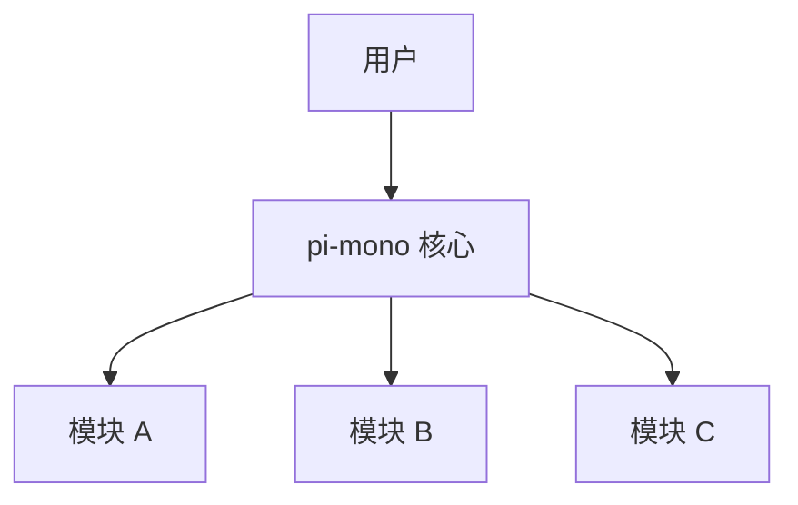

# pi-mono 概览

## 1. 项目简介

pi-mono 是一个 [项目描述待补充]。

### 主要特性

- **特性一**：描述
- **特性二**：描述
- **特性三**：描述

## 2. 架构概览



## 3. 核心概念

### 3.1 概念一

描述内容...

### 3.2 概念二

描述内容...

## 4. 快速开始

### 安装

\`\`\`bash
# 安装命令待补充
\`\`\`

### 基本使用

\`\`\`typescript
// 示例代码待补充
\`\`\`

## 5. 项目结构

```
pi-mono/
├── src/           # 源码目录
├── tests/         # 测试目录
├── docs/          # 文档目录
└── examples/      # 示例目录
```

## 6. 相关资源

- [GitHub 仓库](https://github.com/your-org/pi-mono)
- [API 文档](#)
- [贡献指南](#)
