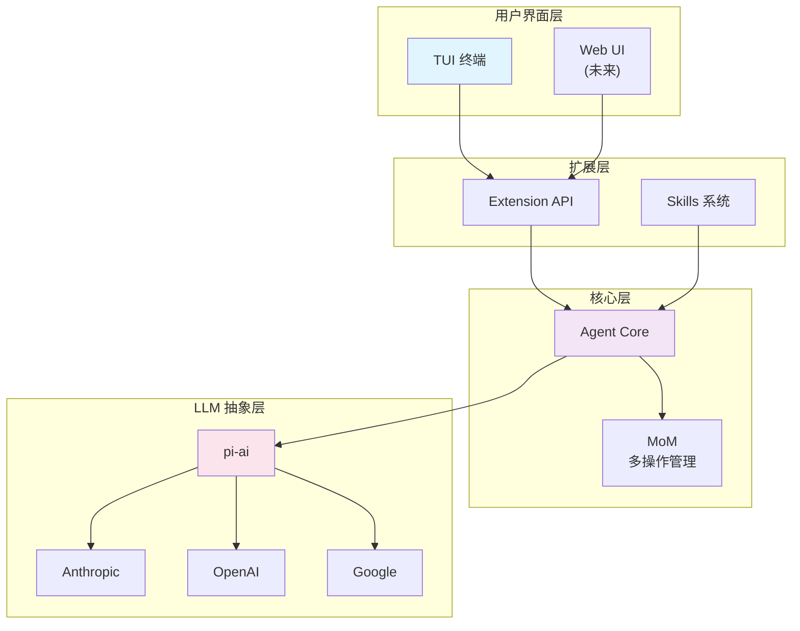
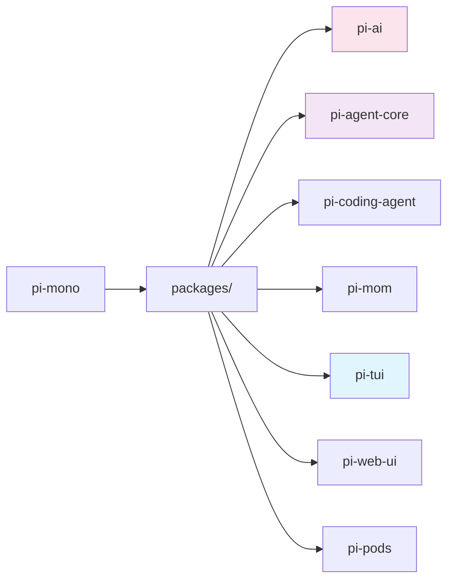
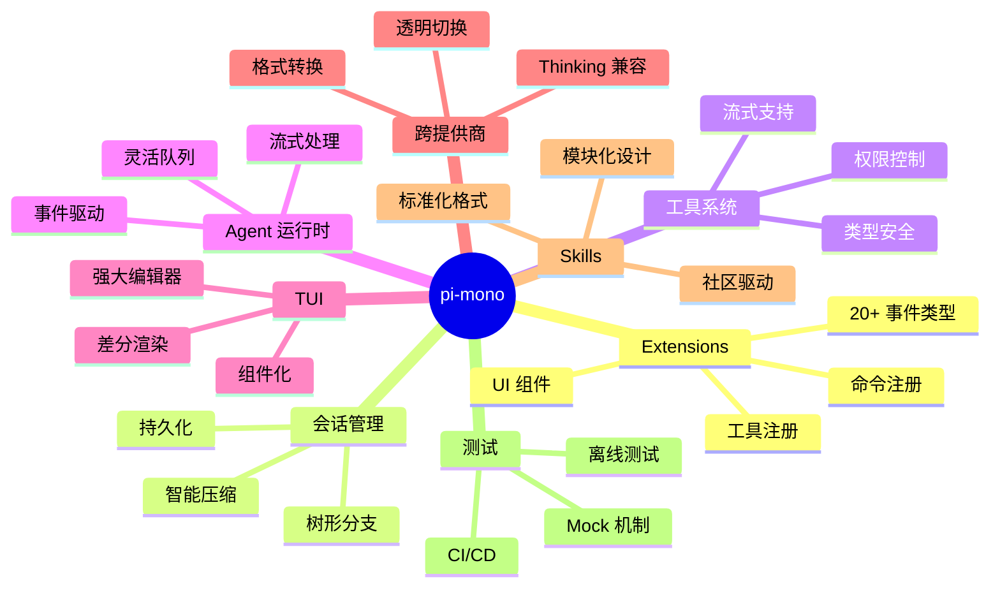
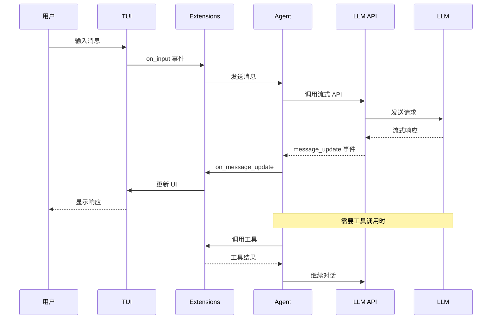

# pi-mono 概览

## 1. 项目简介

pi-mono 是一个 AI 编程助手 monorepo，由 Mario Zechner (badlogic) 开发。

### 主要特性

- **"不内置"策略** - 让用户通过扩展塑造 pi，而不是被 pi 限制
- **类型安全** - 完整的 TypeScript 类型系统
- **可扩展** - 强大的扩展系统和 Skills 机制

## 2. 系统架构

## 3. 包结构

### 包说明

| 包名 | 功能 |
|------|------|
| `pi-ai` | LLM API 抽象层，支持多家提供商 |
| `pi-agent-core` | Agent 核心逻辑 |
| `pi-coding-agent` | 编程助手实现 |
| `pi-mom` | 多操作管理器 |
| `pi-tui` | 终端 UI 框架 |
| `pi-web-ui` | Web UI（未来） |
| `pi-pods` | 容器化部署 |

## 4. 核心系统

## 5. 数据流

## 6. 相关资源

- [GitHub 仓库](https://github.com/badlogic/pi-mono)
- [总索引](/deep-dive/pi-mono-study-index)
- [架构图](/deep-dive/pi-mono-architecture-diagram)
