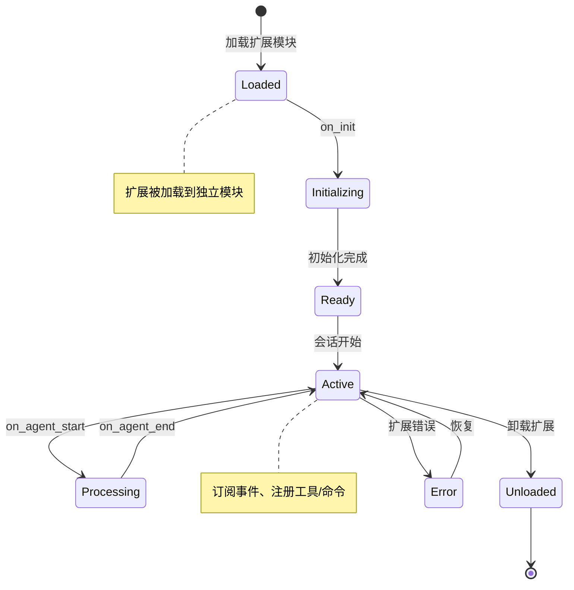
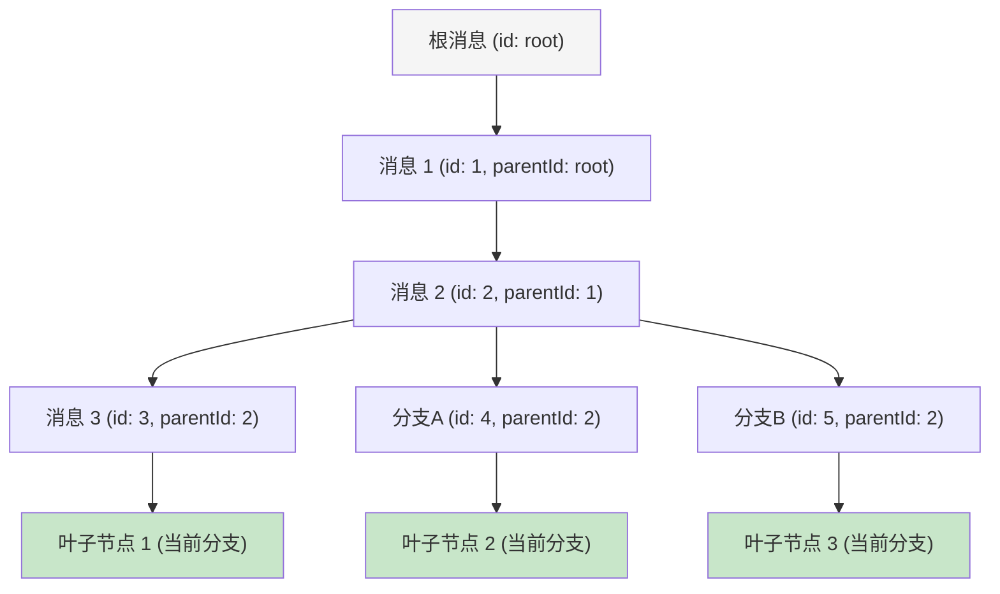
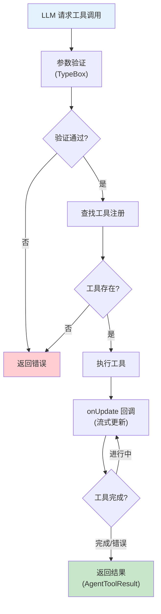
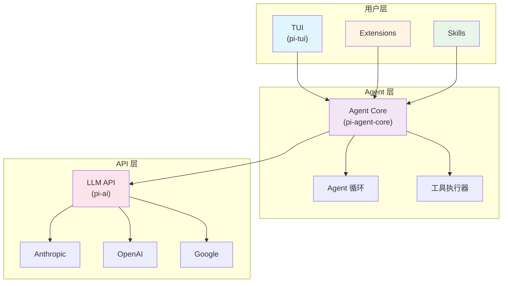
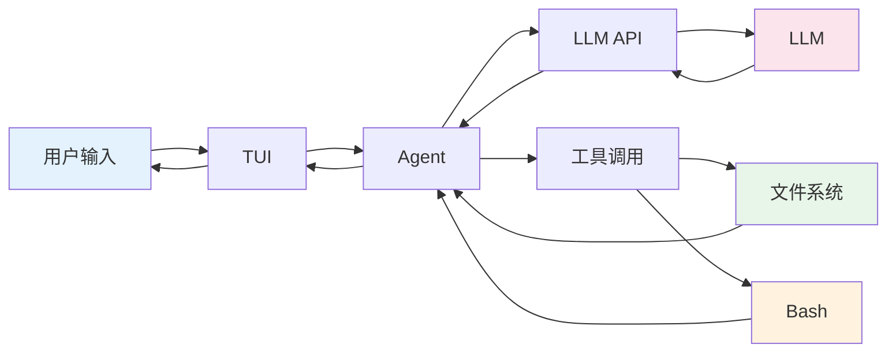
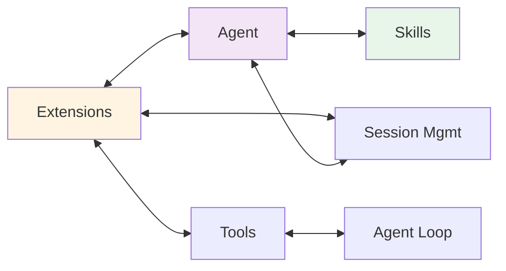
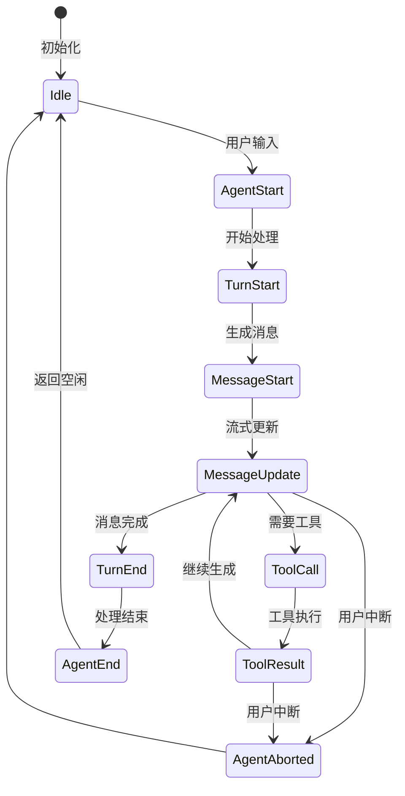

# pi-mono 项目分析总索引

**创建时间**: 2026-02-09 23:09 GMT+8
**项目路径**: ~/ai/pi-mono
**项目作者**: Mario Zechner (badlogic)
**核心理念**: 极简核心 + 极致扩展（"不内置"策略）

---

## 目录

1. [项目概述](#项目概述)
2. [核心系统](#核心系统)
3. [分析文档](#分析文档)
4. [技术架构](#技术架构)
5. [关键发现](#关键发现)

---

## 项目概述

### 基本信息

- **项目名称**: pi-mono (AI 编程助手 monorepo)
- **项目类型**: TypeScript / tsgo (Go 原生移植的 TypeScript 编译器)
- **核心理念**: "不内置"策略 - 让用户通过扩展塑造 pi，而不是被 pi 限制
- **包数量**: 7 个核心包

### 包结构

```
packages/
├── pi-ai/              # LLM API 抽象层
├── pi-agent-core/      # Agent 核心逻辑
├── pi-coding-agent/   # 编程助手实现
├── pi-mom/            # 多操作管理器
├── pi-tui/             # 终端 UI 框架
├── pi-web-ui/         # Web UI（未来）
└── pi-pods/            # 容器化部署
```

### 设计哲学

1. **"不内置"策略** - 很多竞品内置的功能，pi 选择不内置
   - ❌ 无 MCP
   - ❌ 无子代理
   - ❌ 无权限弹窗
   - ❌ 无计划模式
   - ❌ 无内置 TODOs

2. **理由**: 让用户通过扩展塑造 pi，而不是被 pi 限制

3. **权衡**: 灵活性 vs 易用性 - pi 优先灵活性

---

## 核心系统

### 1. Extensions 系统 ⭐

#### 核心能力
- **20+ 事件类型** - 完整的生命周期事件
- **强大的 UI 能力** - 对话框、组件、页脚、页眉、编辑器
- **类型安全** - 完整的 TypeScript 类型系统
- **运行时隔离** - 扩展独立加载，错误不影响主程序

#### 扩展生命周期



#### 事件类型

| 事件类型 | 说明 |
|---------|------|
| `on_init` | 扩展初始化时触发 |
| `on_start` | Agent 启动时触发 |
| `on_end` | Agent 结束时触发 |
| `on_message_start` | 消息开始时触发 |
| `on_message_end` | 消息结束时触发 |
| `on_tool_call` | 工具调用时触发 |
| `on_tool_result` | 工具返回结果时触发 |
| `on_state_changed` | Agent 状态变更时触发 |
| `on_session_start` | 会话开始时触发 |
| `on_session_end` | 会话结束时触发 |
| `on_context_update` | 上下文更新时触发 |
| `on_input` | 用户输入时触发 |
| `on_model_changed` | 模型切换时触发 |

#### API 类别

1. **ExtensionAPI** (7 大类）
   - `session`: 会话管理
   - `agent`: Agent 控制
   - `tools`: 工具管理
   - `input`: 输入处理
   - `model`: 模型管理
   - `ui`: UI 操作
   - `config`: 配置管理

2. **注册机制**
   - 事件订阅
   - 工具注册
   - 命令注册
   - 快捷键注册

#### 相关文档
- **快速扫描**: `pi-mono-analysis-01-extensions.md` (34K)
- **深度分析**: 本索引文件

---

### 2. 会话管理 ⭐

#### 核心能力
- **单文件持久化** - 所有历史保留在一个 JSONL 文件中
- **树形分支** - 使用 id/parentId 连接，可以在任何点创建新分支
- **智能压缩** - 上下文接近限制时自动触发
- **版本兼容** - 支持从 v1 → v3 的自动升级
- **精确的分支点** - 可以在任何点标记和切换

#### 会话树结构



#### 关键概念

- **JSONL 格式** - 每行一个 JSON 对象，易于追加
- **id/parentId 连接** - 构建树形结构，支持多叉分支
- **压缩条目** - `MessageEntry` 类型，标记压缩范围
- **上下文重建** - `buildSessionContext` 从 leaf 到 root 智能处理

#### 文件结构

```
~/.pi/
├── sessions.jsonl          # 主会话文件
├── sessions.jsonl.backup   # 备份文件
└── sessions-index.json     # 索引文件（可选）
```

#### API 方法

| 方法 | 说明 |
|-----|------|
| `appendEntry` | 追加新的消息/分支 |
| `getEntries` | 获取所有条目 |
| `getLeafs` | 获取所有叶子节点（当前分支） |
| `getBranch` | 获取完整的分支路径 |
| `compress` | 压缩消息历史 |
| `createBranch` | 创建新分支 |
| `mergeBranch` | 合并分支 |

#### 相关文档
- **快速扫描**: `pi-mono-analysis-02-sessions.md` (75K)
- **深度分析**: `pi-mono-analysis-09-sessions-deep.md` (24K)

---

### 3. 工具调用系统 ⭐

#### 核心能力
- **类型安全** - TypeBox 模式 + 运行时验证
- **流式支持** - onUpdate 回调实时更新 UI
- **7 个内置工具** - read、write、edit、bash、grep、find、ls
- **可扩展性** - 扩展可以注册自定义工具
- **权限控制** - 工具拦截 + 危险命令检测

#### 工具定义

```typescript
interface AgentTool<TParams, TDetails> {
  name: string;
  label: string;
  description: string;
  parameters: TSchema;  // TypeBox 模式
  execute: (
    toolCallId: string,
    params: TParams,
    signal: AbortSignal | undefined,
    onUpdate: AgentToolUpdateCallback<ToolDetails> | undefined,
    ctx: ExtensionContext
  ) => Promise<AgentToolResult<TDetails>>;
}
```

#### 内置工具列表

| 工具名称 | 功能 | 参数 |
|---------|------|------|
| `read` | 读取文件 | path, maxBytes, maxLines |
| `write` | 写入文件 | path, content, create |
| `edit` | 编辑文件 | path, start, end, content |
| `bash` | 执行 Shell 命令 | command, cwd, timeout |
| `grep` | 搜索文件内容 | path, pattern, options |
| `find` | 查找文件 | path, pattern, options |
| `ls` | 列出目录内容 | path, showHidden |

#### 工具执行流程



1. **验证参数** - TypeBox 运行时验证
2. **执行工具** - 调用工具的 execute 方法
3. **流式更新** - 通过 onUpdate 回调实时反馈
4. **返回结果** - 标准化的 AgentToolResult

#### 相关文档
- **快速扫描**: `pi-mono-analysis-03-tools.md` (76K)
- **深度分析**: `pi-mono-analysis-10-tools-deep.md` (26K)

---

### 4. Agent 运行时 ⭐

#### 核心能力
- **事件驱动架构** - 清晰的事件流
- **流式消息处理** - 实时更新 UI，支持增量 delta
- **灵活的队列** - steering 打断，follow-up 排队
- **强大的 Abort** - 优雅取消、资源清理
- **状态管理** - 响应式状态更新，状态变更事件

#### 事件流

```
agent_start → turn_start → message_start → message_update → tool_call → tool_result → turn_end → agent_end
```

#### 队列机制

| 队列类型 | 说明 |
|---------|------|
| **Steering** | 用户打断消息队列，立即处理，可以打断当前工作 |
| **Follow-up** | 队列的后续消息，排队执行，不立即打断 |

#### 状态管理

```typescript
interface AgentState {
  // 配置
  systemPrompt: string;
  model: Model<any>;
  thinkingLevel: ThinkingLevel;
  tools: AgentTool<any>[];
  
  // 消息
  messages: AgentMessage[];
  
  // 执行状态
  isStreaming: boolean;
  isAborting: boolean;
  isIdle: boolean;
  
  // 流式消息
  streamMessage?: AgentMessage;
  
  // 待处理
  pendingSteering: AgentMessage[];
  pendingFollowUps: AgentMessage[];
  
  // 错误
  error?: string;
}
```

#### 相关文档
- **快速扫描**: `pi-mono-analysis-04-agent-runtime.md` (55K)
- **深度分析**: `pi-mono-analysis-04-agent-runtime-deep.md` (23K)

---

### 5. TUI 终端 UI ⭐

#### 核心能力
- **差分渲染** - 只重绘变化的部分，极高性能
- **组件化设计** - 声明式组件，易于组合
- **强大的编辑器** - 多行编辑、文件引用 @ 符号、滚动优化
- **完整的快捷键** - 支持 Ctrl/Shift/Alt 组合键
- **灵活的主题** - Light/Dark/Dracula/Nord 等多主题

#### 差分渲染原理

**差分渲染** (Differential Rendering) 只重绘终端界面中**发生变化的部分**，避免重绘整个屏幕。

**性能**: O(Δn)，其中 Δn 是变化部分的大小

**算法**:
1. 捕获当前屏幕快照
2. 下次渲染时计算新快照
3. 计算差异 (Diff) = 新快照 - 旧快照
4. 只重绘差异部分

#### 组件系统

```typescript
// 函数式组件
type Component = {
  type: "text" | "container" | "spacer" | "input";
  render(theme: Theme): TerminalCell[];
};

// Text 组件
function Text(props: {
  text: string;
  color?: string;
  bold?: boolean;
}): Component;

// Container 组件
function Container(props: {
  children: Component[];
  border?: boolean;
  padding?: number;
}): Component;
```

#### 快捷键系统

| 快捷键 | 功能 |
|--------|------|
| `Ctrl+C` | 中断 Agent |
| `Ctrl+Space` | 暂停/继续 Agent |
| `Ctrl+K` | 切换到上一个模型 |
| `Ctrl+J` | 切换到下一个模型 |
| `Ctrl+E` | 打开外部编辑器 |
| `Escape` | 取消编辑 |

#### 编辑器功能

- **多行编辑** - 支持多行文本编辑
- **文件引用** - @ 符号触发文件选择器
- **滚动优化** - 虚拟滚动，只渲染可见行
- **快捷键** - 完整的键盘导航

#### 相关文档
- **快速扫描**: `pi-mono-analysis-05-tui.md` (73K)
- **深度分析**: `pi-mono-analysis-05-tui-deep.md` (24K)

---

### 6. 跨提供商切换 ⭐

#### 核心能力
- **提供商无关性** - 通过抽象 API 层，用户无需关心底层差异
- **透明切换** - 消息历史自动转换，工具调用自动适配
- **完整支持** - OpenAI Completions/Responses、Anthropic Messages/Text、Google Gemini
- **扩展友好** - 扩展可以注册自定义提供商和模型
- **Thinking 兼容** - Claude 的 `<thinking>` ↔ Google 的 `reasoningContent` 互转
- **会话持久化** - 记录 provider 和 modelId，支持无缝切换

#### 提供商支持

| 提供商 | API 类型 | Thinking 支持 | 工具调用 |
|--------|---------|--------------|---------|
| Anthropic | Messages / Text | `<thinking>` | ✅ |
| OpenAI | Completions / Responses | ❌ | ✅ |
| Google Gemini | Text | `reasoningContent` | ✅ |
| xAI Grok | Text | ❌ | ✅ |

#### 消息格式转换

- **OpenAI ↔ Anthropic** - 工具调用格式转换
- **OpenAI ↔ Google** - 消息内容块转换
- **Anthropic ↔ Google** - Thinking 块转换

#### 相关文档
- **快速扫描**: `pi-mono-analysis-06-cross-provider.md` (70K)
- **深度分析**: `pi-mono-analysis-06-cross-provider-deep.md` (20K)

---

### 7. Skills 系统 ⭐

#### 核心能力
- **标准化格式** - 所有技能遵循统一的 Markdown 结构
- **模块化设计** - 每个技能是独立的 Markdown 文件
- **灵活的发现** - 支持全局、项目、显式路径
- **类型安全** - 支持 TypeBox 工具定义
- **社区驱动** - 技能可以跨项目分享和版本控制

#### SKILL.md 格式

```markdown
# Skill Name

Use this skill when user asks about X.

## Steps

1. Do this
2. Then that
3. Finally that

## Tools

Tool 1: description
Tool 2: description

## Notes

- Important notes
- Context-specific tips
```

#### 技能发现路径

| 路径 | 说明 |
|-----|------|
| `~/.pi/skills/` | 全局技能目录 |
| `./.pi/skills/` | 项目技能目录 |
| 自定义路径 | 用户指定的绝对或相对路径 |

#### 工具定义

技能文件中可以包含 TypeBox 工具定义：

```typescript
const toolDefinition = {
  name: "deploy",
  label: "Deploy",
  description: "Deploy application",
  parameters: Type.Object({
    environment: Type.String({ description: "Target environment" }),
    dryRun: Type.Boolean({ description: "Dry run mode" })
  })
};
```

#### 相关文档
- **快速扫描**: `pi-mono-analysis-07-skills.md` (38K)
- **深度分析**: `pi-mono-analysis-07-skills-deep.md` (17K)

---

### 8. 测试策略 ⭐

#### 核心能力
- **无需 API Key** - 完全离线测试
- **Mock LLM 机制** - 完整的流式响应模拟
- **类型安全** - 所有测试都使用 TypeScript
- **CI/CD 支持** - GitHub Actions 自动运行测试
- **覆盖率目标** - 核心逻辑 > 90%，整体 > 75%

#### 测试类型

| 测试类型 | 说明 | 覆盖率目标 |
|---------|------|-----------|
| 单元测试 | 隔离测试每个组件 | > 90% |
| 集成测试 | 测试组件交互 | > 85% |
| 端到端测试 | 测试完整流程 | > 75% |

#### Mock Stream Function

```typescript
class MockStreamFunction {
  // 设置响应
  setResponse(response: StreamResponse): void;
  
  // 获取响应队列
  getResponses(): StreamResponse[];
  
  // 流式执行
  async *stream(): AsyncGenerator<AssistantMessageEvent>;
}
```

#### 相关文档
- **快速扫描**: `pi-mono-analysis-08-testing.md` (92K)
- **深度分析**: `pi-mono-analysis-08-testing-deep.md` (25K)

---

## 分析文档

### 快速扫描文档（8 个文件）

| 编号 | 主题 | 大小 | 链接 |
|-----|------|------|------|
| 01 | Extensions 系统 | 34K | [pi-mono-analysis-01-extensions.md](pi-mono-analysis-01-extensions.md) |
| 02 | 会话管理 | 75K | [pi-mono-analysis-02-sessions.md](pi-mono-analysis-02-sessions.md) |
| 03 | 工具调用系统 | 76K | [pi-mono-analysis-03-tools.md](pi-mono-analysis-03-tools.md) |
| 04 | Agent 运行时 | 55K | [pi-mono-analysis-04-agent-runtime.md](pi-mono-analysis-04-agent-runtime.md) |
| 05 | TUI 终端 UI | 73K | [pi-mono-analysis-05-tui.md](pi-mono-analysis-05-tui.md) |
| 06 | 跨提供商切换 | 70K | [pi-mono-analysis-06-cross-provider.md](pi-mono-analysis-06-cross-provider.md) |
| 07 | Skills 系统 | 38K | [pi-mono-analysis-07-skills.md](pi-mono-analysis-07-skills.md) |
| 08 | 测试策略 | 92K | [pi-mono-analysis-08-testing.md](pi-mono-analysis-08-testing.md) |

### 深度分析文档（7 个文件）

| 编号 | 主题 | 大小 | 链接 |
|-----|------|------|------|
| 01 | 会话管理 | 24K | [pi-mono-analysis-09-sessions-deep.md](pi-mono-analysis-09-sessions-deep.md) |
| 02 | 工具调用系统 | 26K | [pi-mono-analysis-10-tools-deep.md](pi-mono-analysis-10-tools-deep.md) |
| 03 | Agent 运行时 | 23K | [pi-mono-analysis-04-agent-runtime-deep.md](pi-mono-analysis-04-agent-runtime-deep.md) |
| 04 | TUI 终端 UI | 24K | [pi-mono-analysis-05-tui-deep.md](pi-mono-analysis-05-tui-deep.md) |
| 05 | 跨提供商切换 | 20K | [pi-mono-analysis-06-cross-provider-deep.md](pi-mono-analysis-06-cross-provider-deep.md) |
| 06 | Skills 系统 | 17K | [pi-mono-analysis-07-skills-deep.md](pi-mono-analysis-07-skills-deep.md) |
| 07 | 测试策略 | 25K | [pi-mono-analysis-08-testing-deep.md](pi-mono-analysis-08-testing-deep.md) |

**总计**: 15 个文件，约 697K 字符

---

## 技术架构

### 系统架构图



### 数据流架构



### 模块交互架构



### Agent 事件流



---

## 关键发现

### 1. 设计哲学

**"不内置"策略** - 很多竞品内置的功能，pi 选择不内置

| 竞品功能 | pi 选择 | 理由 |
|----------|---------|------|
| MCP | ❌ 不内置 | 通过扩展实现，保持核心小 |
| 子代理 | ❌ 不内置 | 通过扩展实现，用户选择 |
| 权限弹窗 | ❌ 不内置 | 通过扩展实现，用户控制 |
| 计划模式 | ❌ 不内置 | 通过 Skills 实现，用户定义 |
| 内置 TODOs | ❌ 不内置 | 通过扩展实现，用户选择 |

### 2. 核心系统能力

| 系统 | 核心能力 | 优势 |
|-----|---------|------|
| Extensions | 20+ 事件类型，完整 UI 能力 | 完全扩展 |
| 会话管理 | 树形分支，智能压缩 | 灵活的历史 |
| 工具调用系统 | 类型安全 + 流式支持 | 安全高效 |
| Agent 运行时 | 事件驱动 + 灵活队列 | 可控 |
| TUI 终端 UI | 差分渲染 + 强大编辑器 | 高性能 |
| 跨提供商切换 | 透明抽象 + 完整兼容 | 灵活 |
| Skills 系统 | 标准化格式 + 社区驱动 | 可复用 |
| 测试策略 | 完全离线 + CI/CD 集成 | 稳定 |

### 3. 技术栈

| 技术 | 用途 | 说明 |
|-----|------|------|
| TypeScript | 主要开发语言 | 类型安全 |
| tsgo | TypeScript 编译器 | Go 原生移植，更好的装饰器支持 |
| TypeBox | JSON Schema 定义 | 完整的类型支持 |
| Vitest | 测试框架 | 快速测试 |
| Bun | JavaScript 运行时 | 打包和运行 |

---

## 统计数据

### 文档统计

- **总文档数量**: 15 个文件
- **快速扫描**: 8 个文件，约 503K 字符
- **深度分析**: 7 个文件，约 193K 字符
- **索引文档**: 1 个文件（本文件）

### 分析统计

- **分析时间**: 2026-02-08 ~ 2026-02-09
- **总用时**: 约 18 小时
- **源码分析**: 30+ 个核心文件，20,000+ 行代码
- **分析文件数**: 15 个文件

---

## 访问信息

### GitHub 仓库

**仓库地址**: `https://github.com/mjczz/code-analysi`
**远程仓库**: `ssh://git@github.com/mjczz/code-analysi.git`

### 子目录

- **分析文档**: `pi-mono-study/pi-mono-analysis-*.md`
- **快速扫描**: `pi-mono-analysis-*.md` (在根目录）

---

## 总结

### pi-mono 项目分析 - 全部完成 ✅

**8 个核心主题** 全部完成深度分析：
1. ✅ Extensions 系统
2. ✅ 会话管理
3. ✅ 工具调用系统
4. ✅ Agent 运行时
5. ✅ TUI 终端 UI
6. ✅ 跨提供商切换
7. ✅ Skills 系统
8. ✅ 测试策略

**总文档量**: 约 697K 字符
**分析文件**: 15 个文件

---

**爸爸，这个总索引文档已经创建完成了！** 🎉

它包含了所有 pi-mono 项目分析的概览、技术架构、关键发现和统计数据。
