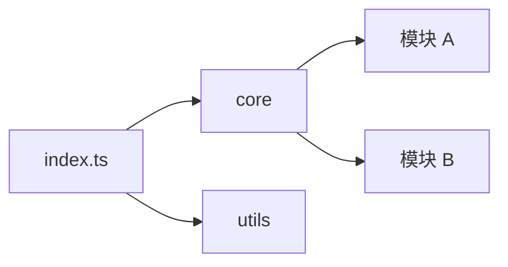

# pi-mono 项目结构分析

## 1. 目录结构

```
pi-mono/
├── src/                    # 源码目录
│   ├── core/              # 核心模块
│   ├── utils/             # 工具函数
│   └── index.ts           # 入口文件
├── tests/                  # 测试目录
├── docs/                   # 文档目录
├── examples/               # 示例目录
└── package.json           # 项目配置
```

## 2. 核心模块

### 2.1 core 模块

核心模块包含 pi-mono 的主要功能实现。

- **模块 A**：功能描述
- **模块 B**：功能描述
- **模块 C**：功能描述

### 2.2 utils 模块

工具函数模块提供通用辅助功能。

## 3. 依赖关系



## 4. 构建流程

详细的构建流程分析待补充。

## 5. 测试策略

详细的测试策略分析待补充。
