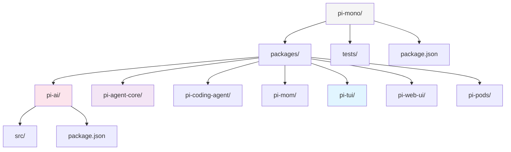
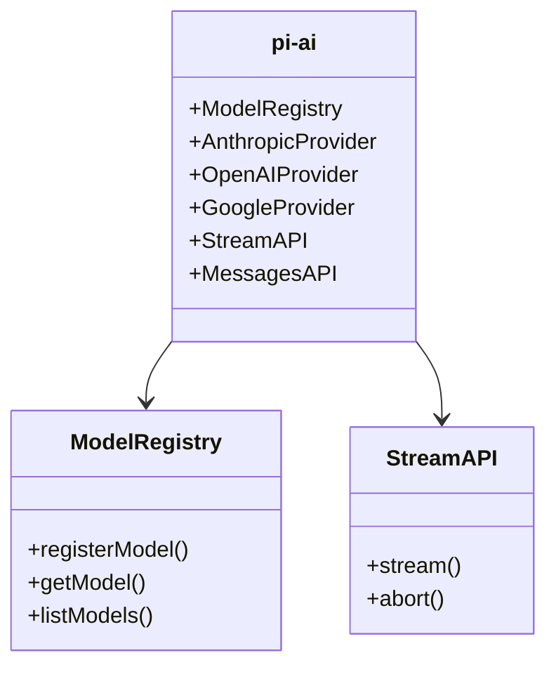
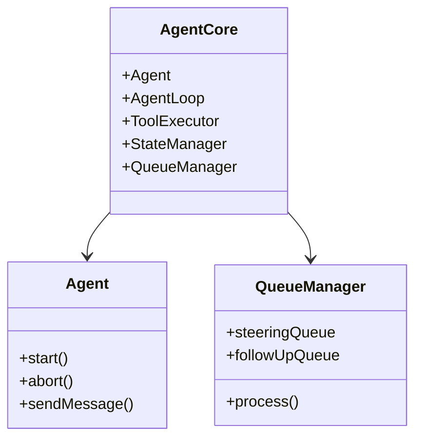
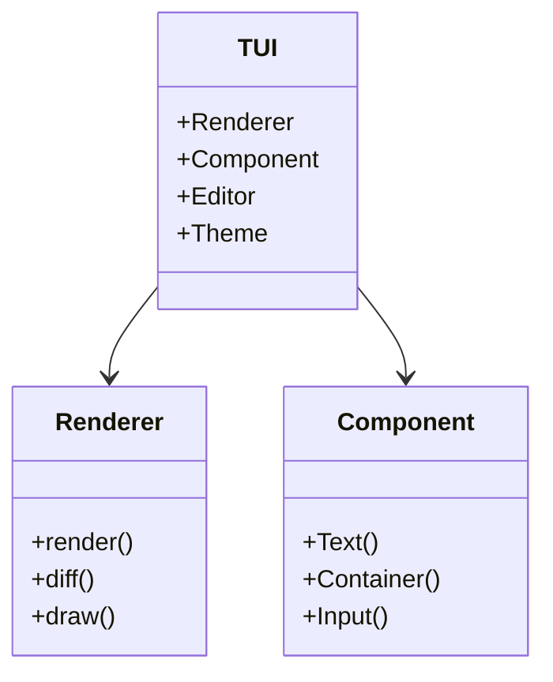
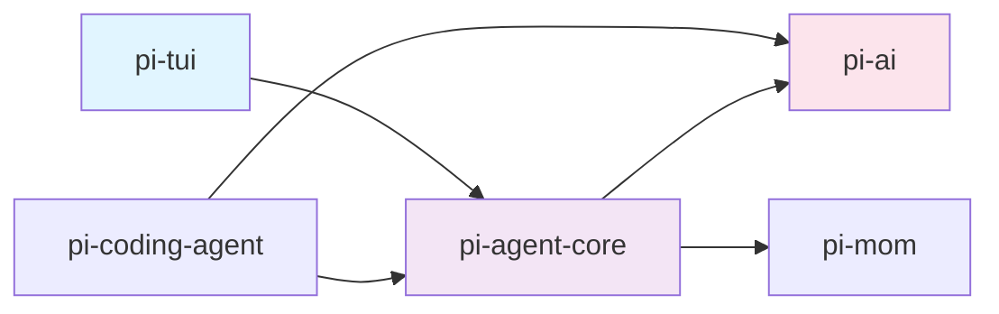

# pi-mono 项目结构分析

## 1. 目录结构

## 2. 核心模块说明

### pi-ai

LLM API 抽象层，支持多家提供商：
- Anthropic (Claude)
- OpenAI (GPT)
- Google (Gemini)
- xAI (Grok)

### pi-agent-core

Agent 核心逻辑：
- 事件驱动架构
- 流式消息处理
- 灵活的队列机制

### pi-tui

终端 UI 框架：
- 差分渲染
- 组件化设计
- 强大编辑器

## 3. 模块依赖关系

## 4. 相关资源

- [总索引](/deep-dive/pi-mono-study-index)
- [GitHub](https://github.com/badlogic/pi-mono)
